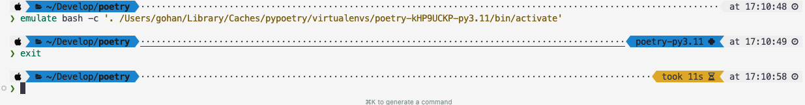
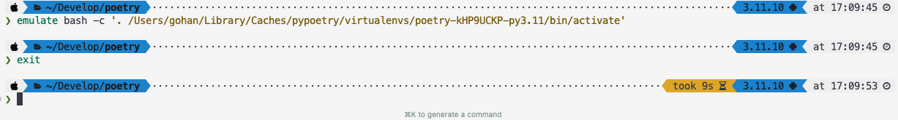

# Poetry 사용법

- [설치법](./설치법.md) 은 페이지 참조 부탁드립니다.

## 주요 도구 소개

### Python
- 3.8+

venv 대신 poetry 사용 
- requirements.txt 대신 pyproject.toml 사용

### Poetry 
- Python 패키지 및 의존성 관리 도구
- `requirements.txt` 대신 `pyproject.toml` 사용

### Pyenv
- Python 버전 관리 도구
- 시스템에 여러 Python 버전 설치 및 전환 가능

## poetry 프로젝트 생성


프로젝트 폴더에서 생성합니다.
```bash
poetry new <project-name>
```

만약 기존 프로젝트 폴더에서 생성하고 싶다면 아래와 같이 합니다.

```bash
poetry init
```

그러면 대화형으로 프로젝트 생성 가능합니다.
기본적으로는 전부 엔터로 넘어가면 됩니다.
추후에 pyproject.toml 파일을 수정해서 추가할 수 있습니다.

```toml
[tool.poetry]
name = "poetry"
version = "0.1.0"
description = ""
authors = ["clorose <gohan9511@gmail.com>"]
readme = "README.md"

[tool.poetry.dependencies]
python = "3.11.10"
requests = "^2.32.3"


[build-system]
requires = ["poetry-core"]
build-backend = "poetry.core.masonry.api"
```

## poetry 로 가상 환경 설정하기

### 1. Python 버전 설정

먼저 사용할 Python 버전을 설정합니다. 이 이유는 poetry 가 가상 환경을 만들 때, 이 버전을 사용하기 때문입니다.
만약 사용하지 않는다면 현재의 global 버전을 사용합니다.

```bash
pyenv global <version>
```

저는 3.11.10 버전을 사용했습니다.

```bash
pyenv global 3.11.10
```

### 2. Poetry 프로젝트 가상화

프로젝트 폴더에서 가상 환경을 만들어줍니다. 

```bash
poetry env use <version>
```

저는 3.11.10 버전을 사용했습니다.

```bash
poetry env use 3.11.10
```

### 3. Pyenv 버전 끊기

여기서 가상 환경을 끊는 이유는 zsh에서 poetry 가상 환경이 뜨지 않고, pyenv 의 버전만 뜨는 문제가 있어서
제가 원한건 poetry 의 가상 환경이 잘 실행중인지 zsh 에서 확인하고 싶어서 끊었습니다.

```bash
pyenv local --unset
```

### 4. 실행

```bash
poetry install
poetry shell
```


```bash
echo $POETRY_ACTIVE
```
를 통해 가상 환경이 잘 실행중인지 확인할 수 있습니다.


## 참고

- 현재 macOS 환경에서만 작업했고, 다른 환경에선 아직 테스트 해보지 않았습니다. 혹시 문제가 있으면 이슈 남겨주세요.
- 이 가이드 라인을 작성하는 이유는 제가 헤메서 시간을 낭비했기 때문입니다. 도움이 되길 바랍니다.
- zsh 환경에서 가상 환경이 pyenv 의 가상만 뜨고, poetry 는 안뜨길래 찾아보다가 만들었습니다.
- 이게 제가 poetry 를 처음 사용해서 그런지 모르겠습니다. 혹시 더 좋은 방법이 있으면 이슈 남겨주세요.



